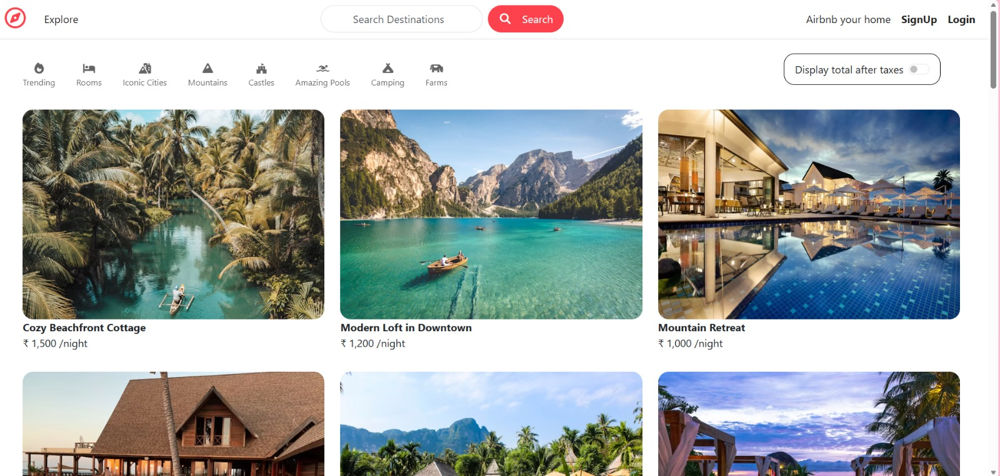

# 🌍 WanderLust

WanderLust is a full-stack travel accommodation platform inspired by modern vacation rental applications. It enables users to discover destinations, explore property listings, securely manage accommodations, and share travel experiences through reviews. The application follows the MVC architecture and is built using RESTful APIs with secure authentication, cloud image storage, and interactive maps.

---

## ✨ Features

* 🔐 Secure User Authentication (Sign Up, Login & Logout)
* 🏡 Complete CRUD Operations for Property Listings
* 🔄 RESTful API Architecture
* 🔍 Search Listings by Title, Location, and Country
* 🏷️ Category-based Listing Filters
* ⭐ Reviews & Ratings
* 📷 Image Upload & Cloud Storage using Cloudinary
* 🗺️ Interactive Maps & Geolocation using Mapbox
* 👤 Owner-based Authorization
* 🛡️ Server-side Validation using Joi
* 💬 Flash Messages for Better User Experience
* 📱 Fully Responsive User Interface
* ☁️ MongoDB Atlas Cloud Database

---

## 🛠️ Tech Stack

### Frontend

* HTML5
* CSS3
* Bootstrap 5
* JavaScript
* EJS

### Backend

* Node.js
* Express.js
* RESTful APIs

### Database

* MongoDB Atlas
* Mongoose

### Authentication & Security

* Passport.js
* Passport Local
* Express Session
* Connect-Mongo
* Connect-Flash

### Cloud Services

* Cloudinary
* Mapbox Geocoding API

### Validation

* Joi

### Tools

* Git
* GitHub
* VS Code
* Render

---

## 🚀 Key Highlights

* Developed using the **MVC (Model–View–Controller)** architecture.
* Designed and implemented **RESTful APIs** for Listings, Reviews, and User Authentication.
* Integrated **Cloudinary** for secure image upload and cloud storage.
* Implemented **Mapbox Geocoding API** for interactive maps and location services.
* Built secure authentication and authorization using **Passport.js**.
* Added **destination search** and **category-based property filters**.
* Implemented robust server-side validation using **Joi**.
* Managed user sessions with **Express Session** and **Connect-Mongo**.
* Built a responsive and user-friendly interface using **Bootstrap 5**.

---

## 📂 Project Structure

```
WanderLust
│
├── controller/
│   ├── listings.js
│   ├── reviews.js
│   └── users.js
│
├── init/
│   ├── data.js
│   └── index.js
│
├── models/
│   ├── listing.js
│   ├── review.js
│   └── user.js
│
├── public/
│   ├── css/
│   │   ├── rating.css
│   │   └── style.css
│   └── js/
│       ├── map.js
│       └── script.js
│
├── routes/
│   ├── listing.js
│   ├── review.js
│   └── user.js
│
├── utils/
│   ├── ExpressError.js
│   └── wrapAsync.js
│
├── views/
│   ├── includes/
│   │   ├── flash.ejs
│   │   ├── footer.ejs
│   │   └── navbar.ejs
│   │
│   ├── layouts/
│   │   └── boilerplate.ejs
│   │
│   ├── listings/
│   │   ├── index.ejs
│   │   ├── new.ejs
│   │   ├── edit.ejs
│   │   └── show.ejs
│   │
│   ├── users/
│   │   ├── login.ejs
│   │   └── signup.ejs
│   │
│   └── error.ejs
│
├── app.js
├── cloudConfig.js
├── middleware.js
├── schema.js
├── package.json
├── package-lock.json
├── .gitignore
└── README.md
```
---

## ⚙️ Installation

### Clone the repository

```bash
git clone https://github.com/your-username/WanderLust.git
```

### Navigate to the project directory

```bash
cd WanderLust
```

### Install dependencies

```bash
npm install
```

### Configure Environment Variables

Create a `.env` file in the project root and add:

```env
ATLASDB_URL=your_mongodb_atlas_connection_string
SECRET=your_session_secret
MAP_TOKEN=your_mapbox_access_token
CLOUD_NAME=your_cloudinary_cloud_name
CLOUD_API_KEY=your_cloudinary_api_key
CLOUD_API_SECRET=your_cloudinary_api_secret
```

### Run the application

```bash
npm start
```

or

```bash
node app.js
```

---

## 🌐 Live Demo

🔗 https://wanderlust-z0s0.onrender.com/listings


---

## 📸 Project Preview


---

## 👩‍💻 Author

**Manya H R**

Computer Science Engineering Student

Passionate about Full Stack Web Development, Problem Solving, and Building Scalable Web Applications.
